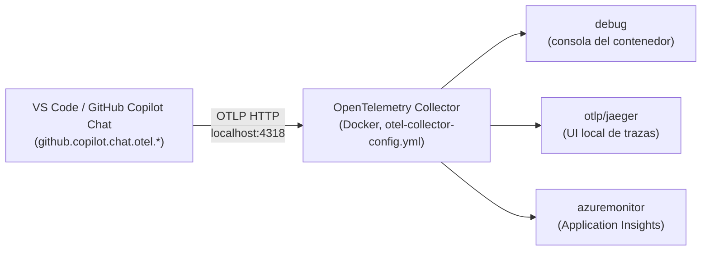

# Trazas de Copilot Chat en VS Code → Application Insights

## Cómo funciona hoy



1. **VS Code emite las trazas directamente**, sin pasar por mitmproxy ni por este addon. La propia extensión de GitHub Copilot Chat incluye soporte nativo de OpenTelemetry (ajustes `github.copilot.chat.otel.*`) que exporta spans de cada interacción del agente (peticiones de chat, tool calls, etc.).
2. Por defecto exporta por **OTLP sobre HTTP a `http://localhost:4318`**, que es exactamente el receptor `otlp/http` definido en `otel-collector-config.yml`. Por eso no hace falta ninguna instrumentación adicional en `addon.py`: el colector ya escucha ahí.
3. El **collector** (contenedor Docker) recibe esas trazas y las reenvía a tres exporters en paralelo: `debug` (log por consola), `otlp/jaeger` (si tienes Jaeger levantado en la red de Docker) y `azuremonitor`, que las empuja a Application Insights usando `APPLICATIONINSIGHTS_CONNECTION_STRING`.

## Activar la emisión de OTel en VS Code

Añade esto a tu `settings.json` (usuario o workspace):

```jsonc
{
  "github.copilot.chat.otel.enabled": true,
  "github.copilot.chat.otel.exporterType": "otlp-http",
  "github.copilot.chat.otel.otlpEndpoint": "http://localhost:4318",
  // Ojo: incluye el contenido completo de prompts/respuestas en los spans.
  // Puede contener información sensible, actívalo solo si lo necesitas.
  "github.copilot.chat.otel.captureContent": false
}
```

Algunos matices:

- Estos ajustes pueden estar gestionados por política de organización; si no ves efecto, comprueba si tu administrador los ha bloqueado.
- `exporterType` también admite `otlp-grpc` (necesitarías exponer el receptor `grpc` en el collector, no solo `http`), `console` (para depurar sin collector) o `file` (usa `github.copilot.chat.otel.outfile`).
- El collector debe estar **arrancado antes** de generar tráfico en Copilot Chat; si VS Code no puede conectar a `localhost:4318`, la exportación falla en silencio (no bloquea el chat, simplemente no llegan trazas).

## Configurar la connection string de App Insights

El colector lee `APPLICATIONINSIGHTS_CONNECTION_STRING` de una variable de entorno (ver `otel-collector-config.yml`), así que hay que tenerla exportada en el shell **antes** de lanzar el `docker run`:

```bash
# Copia .env.example a .env y rellena el valor real (no se commitea, ver .gitignore)
cp .env.example .env

# Carga las variables del .env en el shell actual
set -a
source .env
set +a
```

O, si prefieres no usar un fichero, exporta la variable directamente:

```bash
export APPLICATIONINSIGHTS_CONNECTION_STRING="InstrumentationKey=...;IngestionEndpoint=..."
```

## Crear el colector en Docker

Con la variable ya exportada en el shell, pásala al contenedor con `-e` (docker toma el valor del entorno del host cuando no se indica `=valor`):

```bash
docker run -d --name otel-collector \
  -p 4317:4317 \
  -p 4318:4318 \
  -e APPLICATIONINSIGHTS_CONNECTION_STRING \
  -v $(pwd)/otel-collector-config.yml:/otel-local-config.yaml \
  ghcr.io/open-telemetry/opentelemetry-collector-releases/opentelemetry-collector-contrib:latest \
  --config otel-local-config.yaml
```

## Verificación

1. Con el colector arriba (`docker logs -f otel-collector`) y los ajustes de VS Code activados, abre Copilot Chat y lanza una petición.
2. Deberías ver los spans reflejados en el log `debug` del colector casi al instante.
3. Si usas Jaeger, comprueba su UI (normalmente `http://localhost:16686`) para ver la traza completa de la interacción.
4. En Application Insights, las trazas tardan algo más en indexarse (transaction search / Application Map); si no aparecen, revisa que la connection string sea correcta y que el exporter `azuremonitor` no esté comentado en `otel-collector-config.yml`.
